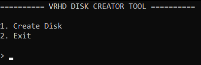

# VRHD Hard Disk Format

Fast and Simple Format for Emulators 

### What it can ?
- [X] Storage Data
- [X] Fast Transfer
- [X] Running OS
- [ ] Compress Bytes  

### Disk Creation

Tool which can create this _Format_ is **VRHD Creator tool**  
this tool wrote on Python. In tool script just follow steps 

> [!WARNING]
> If you set big size for virtual disk space file size of disk file equal you size which you set

> Tested Emulators:  
> Qemu  
> Limbo PC Emulator

### Developers
Danil Vyushenko  
Ahmed Barakat
